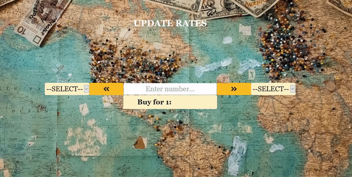

# Exchange App

The lightweight exchange tool is my first experience with the Laravel framework, with a little touch of Vue.js. 
The currency exchange rates are imported into database from [bank.lv](https://www.bank.lv/vk/ecb.xml) xml file.
There are two ways of import - artisan command and http request. The web interface also allows calculating exchange for
the desired amount of money.
